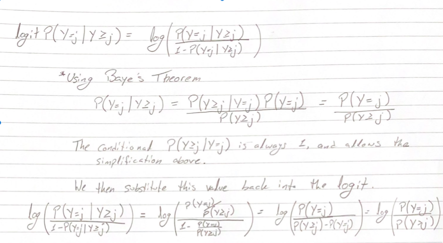

```{r setup, include=FALSE}
knitr::opts_chunk$set(echo = TRUE)
library(VGAM)
```

##Problem 1

**a.** The image below shows the mathematical equivalency of the logit of conditional probabilities \(P(Y = j|Y\geq j)\) and the log odds of \(\theta_j\): \(/theta_j = \frac{P(Y=j)}{\sum^J_{k=j+1}P(Y=k)}\). 

The image begins with a deconstruction of the logit of the conditional probability and uses Baye's theorem to simplify the inside of the log. The result is the value of interest, log odds of \(\theta_j\)

(If the image does not appear, it can also be found within the same folder as this markdown file)


**b.** \(e^{\theta_j} = \frac{P(Y=j)}{P(Y>j)}\) is interpreted as the odds of falling into category j against the odds of falling into a category greater than j. 

##Problem 2

```{r, include = FALSE}
pdac <- read.csv('pancreatic_cancer_urine_biomarkers.csv')

pcstage <- pdac %>% 
  filter(diagnosis == 'PDAC') %>% 
  mutate(stage = factor(str_remove(stage, '[AB]'), ordered = TRUE)) %>%
  select(-diagnosis)

model <- vglm(stage ~ age + sex_at_birth + creatinine + LYVE1 + REG1B + TFF1,
             sratio(), data = pcstage)

CI <- confint(model, method = 'profile', level = 0.90)
```

VGAM uses the term *stopping ratio* instead of *continuation ratio* and therefore that is how the general linear model was set up. The coefficients and their 90% CI using method = 'profile' are reported below. A Hauck-Donner effect was found for Intercept 1 and Intercept 3, which can cause problems with our estimate and CI. This effect can occur when parameters are near a boundary or there are perfect separation in the groups.

```{r}
coef(model, matrix.out = TRUE)
CI
```
We now look more closely at the parameter values associated with LYEV1.

Below, we first look at the estimates for LYVE1 for Stage 1 against all stages greater than 1, Stage 2 against all stages greater than 2, and Stage 3 against stage 4.
First, an increase by 1 unit in LYEV1 means the odds of the tumor being in stage I are \((1-.7979 = .2021)\) 20.21% lower than the odds of being a later stage. The 90% CI for this effect on odds is \((.6504,.9602)\).
Similar interpretations follow for the increase in LYEV1's effect on the odds of the tumor being Stage 2, \(1-.889 = .111\) times lower,against the odds the tumor is at a later stage. 90% CI is \((.8097,.9726)\).
The effect of LYEV1 on the odds of Stage 3 against Stage 4, though, we estimate that the odds are 1.035 times greater that the tumor is Stage 3 against the odds it's Stage 4.
The CI, though, has a range of \((.9088, 1.181)\). The inclusion of 1 in that interval means we cannot be certain at 90% confidence, that the effect of LYEV is either increasing or decreasing the odds. 

```{r,}
exp(coef(model, matrix.out = TRUE)['LYVE1',])
exp(CI[13:15,])
```

##Problem 3

**a.** To coincide with the researcher's hypothesis, the following constraints have been put in place for the \(\theta_j\). You'll notice for example that \(\beta_{0j}\) represents the intercept, and it's different for each one. Meanwhile \(\beta_{S}\) and \(\beta_{C}\) are unchanging becuase the researcher believes these to have no particular effect. Finally, the \(\beta_{Ai}\), \(\beta_{Li}\), and \(\beta_{Ri}\), remain the same for both \(\theta_1\) and \(\theta_2\), but differs for \(\theta_3\) as we anticipate the effect on the odds to be different for this final group. Similarly \(beta_{Ti}\) is the same for \(\theta_2\) and \(\theta_3\), but differs for \(\theta_1\).

\[\theta_1 = \beta_{01} + \beta_{A1}x_A + \beta_{S}x_S + \beta_{C}x_C + \beta_{L1}x_L + \beta_{R1}x_R + \beta_{T1}x_T\]
\[\theta_2 = \beta_{02} + \beta_{A1}x_A + \beta_{S}x_S + \beta_{C}x_C + \beta_{L1}x_L + \beta_{R1}x_R + \beta_{T2}x_T\]
\[\theta_3 = \beta_{03} + \beta_{A2}x_A + \beta_{S}x_S + \beta_{C}x_C + \beta_{L2}x_L + \beta_{R2}x_R + \beta_{T2}x_T\]

**b.** Within the code, we test the Researcher's hypothesized model (model1) against a parallel model (model2) and a fully flexible model (model).

```{r, include = FALSE}
con_int <- diag(3)
con_age <- matrix(c(1,1,0,0,0,1), nrow = 3, ncol = 2)
con_sex <- matrix(1, nrow = 3, ncol = 1)
con_cre <- matrix(1, nrow = 3, ncol = 1)
con_LY <- matrix(c(1,1,0,0,0,1), nrow = 3, ncol = 2)
con_REG <- matrix(c(1,1,0,0,0,1), nrow = 3, ncol = 2)
con_TFF <- matrix(c(1,0,0,0,1,1), nrow = 3, ncol = 2)

con_all <- list("(Intercept)" = con_int, 
                "age" = con_age,
                "sex_at_birth" = con_sex, 
                "creatinine" = con_cre, 
                "LYVE1" = con_LY, 
                "REG1B" = con_REG, 
                "TFF1" = con_TFF)

model1 <- vglm(stage ~ .,
              sratio(),
              constraints = con_all,
              data = pcstage)

model2 <- vglm(stage ~ .,
              sratio(parallel = TRUE),
              data = pcstage)
```

Comparing Model1 to Model2 below, we see statistically significance reported from the anova function using the Likelihood Ratio Test. Confirming with the AIC afterwards, we see that the researcher's model performed better with an \(AIC = 461.8031\), and so we conclude that the researcher's model is a better fit for the data than a parallel (intercept only) model. 

```{r}
#Researcher's hypothesis (model1) vs parallel (model2)
anova(model1, model2, type = 1, test = 'LRT')
c(AIC(model1), AIC(model2))
```

Next we compare Model1 to Model, the fully flexible option with no constraints on the parameters. Unlike before, the anova function's Likelihood Ratio Test does not show a significant difference between these two models. The AIC for the researcher's model, though, is smaller at \(AIC = 461.8031\) compared to the other model's \(AIC = 473.4768\). What this means is that neither model is significantly better than the other at fitting to the data, *but* the the researcher's less complex model has a smaller AIC meaning we have a simpler model without experiencing a significant loss to our fit; making the researcher's model a better option for the data than the fully flexible model. 

```{r}
#Researcher's hypothesis (model1) vs fully flexible (model)
anova(model1, model, type = 1, test = 'LRT')
c(AIC(model1), AIC(model))
```

Now that we've confirmed the researcher's model is a good fit for the data when compared to the the full and intercept only models, we can look at the estimates and see if they agree with the researcher's hypotheses. We will look at each of the researcher's points separately, and the referenced coefficient estimates and confidence intervals can be found at the bottom:

1. Higher odds of \(\theta_1\) and \(\theta_2\) with increase in \(x_A\), but lower odds for \(\theta_3\).

The positive term for age:1 and negative term for age:2 agree with the researcher's hypothesis, and the 90% CI for these coefficients also confirms their significance.

2. Lower odds of \(\theta_1\) and \(\theta_2\) with increase in \(x_L\), but lower odds for \(\theta_3\).

The negative estimate for \(\hat\beta_{L1} = -.136\) and positive estimate for \(\hat\beta_{L2} = .019\) seem to agree with the researcher, but the 90% CI only confirms a significant effect from \(\hat\beta_{L1}\) since the CI for \(\hat\beta_{L2}\) includes 0. 

3. Higher odds of \(\theta_1\) and \(\theta_2\) with increase in \(x_R\), but lower odds for \(\theta_3\).

The estimates from the model agree with the researcher, but the 90% CI shows that their effect is not significant, and so we reject the researcher's hypothesis on this effect of REG1B on the odds. 

4. Higher odds of \(\theta_1\) with increase in \(x_T\), but lower odds for \(\theta_2\) and \(\theta_3\).

The model also does not agree with the researcher on the effect on odds by TFF1. The signs on the terms are opposite what the researcher hypothesized, and while this is not significant at 90% for \(\hat\beta_{T2}\), we actually do see a significance at 90% for \(\hat\beta_{T2}\) with a confidence interval of \((-.00149, -.000045)\). This means that the model supports the statement that there are lower odds of a Stage 1 tumor against more advanced stages when TFF1 is found in higher amounts, opposite of what the researcher anticipated.

5. No effect from creatinine or sex on the odds.

The 90% CI for sex agrees with the researcher as it includes 0 within it, so it's not significant at this level. The CI for creatinine, though, shows there may be a negative effect on the odds with more creatinine is present. Therefore, the conclusion that creatinine does not effect the odds is not supported by the model


```{r}
summary(model1)
confint(model1, method = 'profile', level = 0.90)
```
